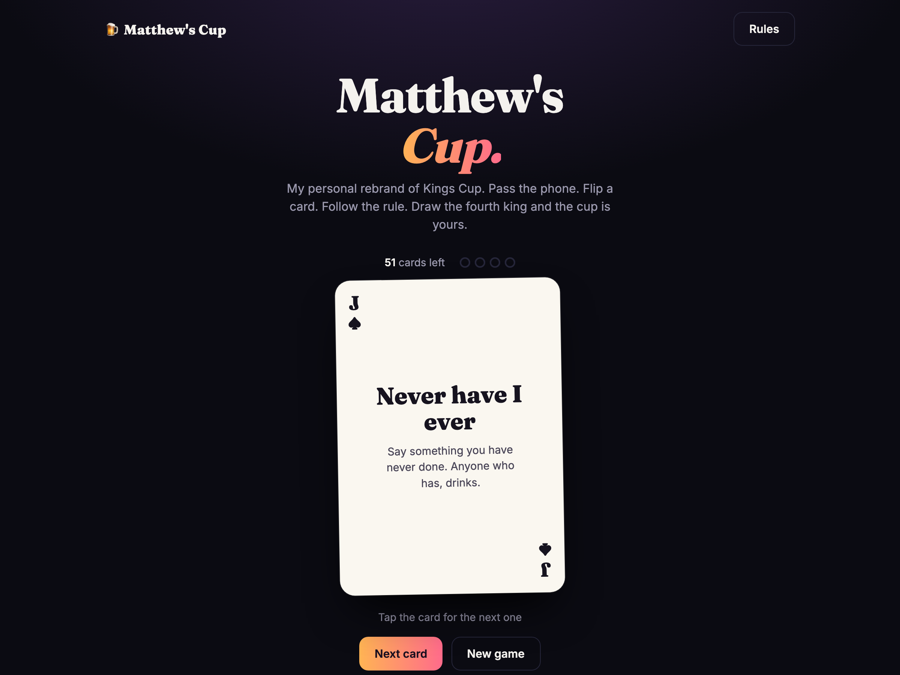

# Matthew's Cup

My personal rebrand of the classic drinking game Kings Cup, rebuilt as a fast, modern, mobile-first web app.

**Live:** https://matthewscup.matthew-tran.com



## How to play

1. Gather 2 or more players in a circle, each with a drink in hand.
2. Pass the phone around. On your turn, tap the card to flip it.
3. Follow the rule shown on the card (tap **Rules** for the full list).
4. Each king adds to the cup. Whoever draws the fourth king drinks it.

*Drink responsibly. Never drink and drive. Must be of legal drinking age.*

## Tech

Plain HTML, CSS and vanilla JavaScript. There is no build step and no dependencies.
Everything is in [`public/`](public).

```sh
python3 -m http.server 8000 -d public   # then open http://localhost:8000
```

Deployed on Vercel (see `vercel.json`).

## What changed in v2

- Replaced the PHP/Silex Heroku starter template with a static single-page app
- Dark, card-based UI with responsive layout, keyboard and screen-reader support, and reduced-motion support
- Full 52-card shuffled deck, king counter, rules dialog and game-over state
